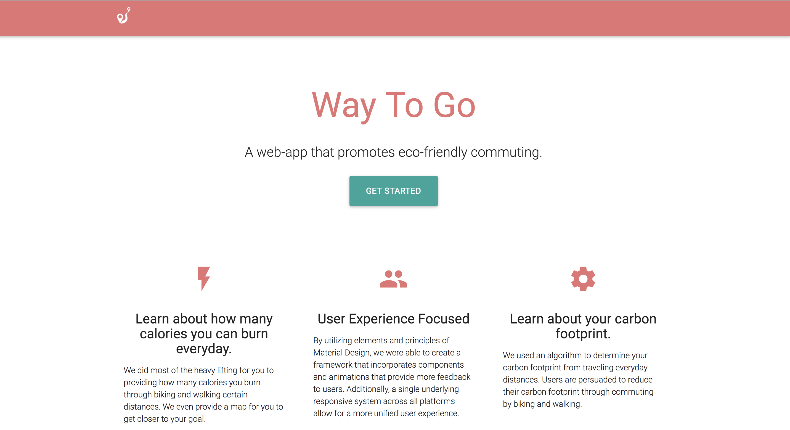
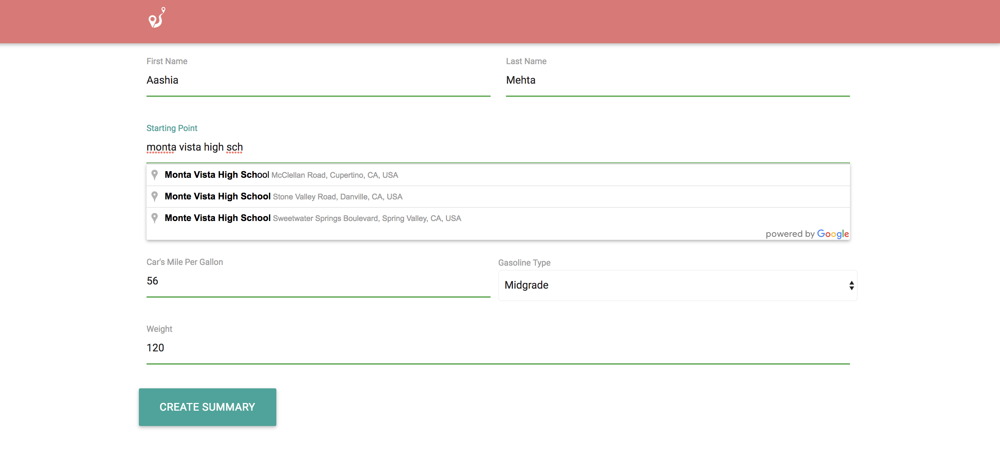
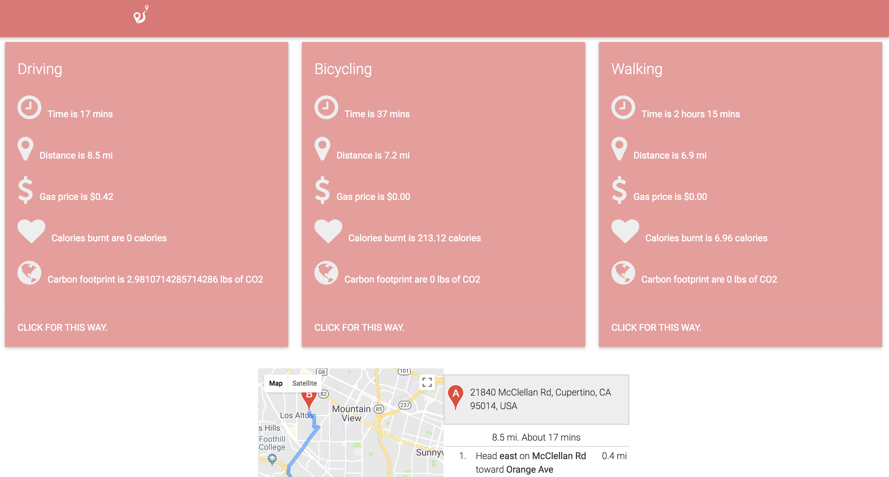

# WayToGo
A web-application using the Google Maps API to recognize the most eco-friendly commuting.

By: Aashia Mehta and Shiv Ansal

## Functionalities
- [x] User can input their name, a starting point, destination, car's MPG, gasoline type, and their weight.
- [x] Uses materialize.css as a framework for the website for a clean UI
- [x] Starting point and destination give auto-suggestions depending on what the user types.
- [x] User is given the time it takes from point A to point B, distance, gas price, calories burnt, and their carbon footprint.
- [x] A map is shown with written directions on how to get from point A to point B.

## Images

## Notes
We noticed that in this fast-paced technology age more teenagers are relying on driving, instead of more eco-friendly ways to commute such as biking or walking. Driving has become the mainstream form of transportation and we planned to create a sleek website to avoid this. People are unaware of what carbon footprints are and how they can make simple differences. We showed them what they would gain through walking and biking, as well as recommendations for specific routes they take daily.
